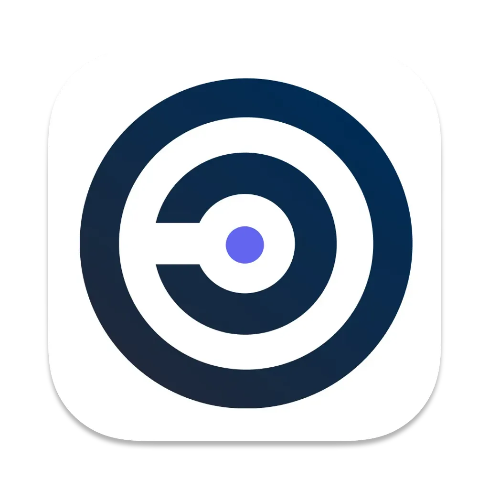

# SCANOSS Code Compare

SCANOSS Code Compare is a streamlined desktop application for managing open source findings with a clean, distraction-free interface. It features vim-style navigation (j/k), side-by-side code comparison for both snippet and 100% matches, and robust decision management that persists across scans. Users can quickly filter results, mark components as included/omitted/replaced with single keystrokes, and access their previous decisions in future scans.


## Features

- 🔍 Advanced code scanning and component identification
- 📊 Detailed dependency analysis and visualization
- 📝 License compliance checking and management
- 🔄 Real-time scanning results
- ⚡ Fast and efficient local processing
- 🎯 Accurate component matching
- 🖥️ Cross-platform support

## Prerequisites

- Go 1.x or higher
- Node.js and npm
- Wails CLI (`go install github.com/wailsapp/wails/v2/cmd/wails@latest`)

## Installation

### Quick Install (Recommended)

Install SCANOSS Code Compare with a single command:

**macOS / Linux:**
```bash
curl -fsSL https://raw.githubusercontent.com/scanoss/scanoss.cc/main/scripts/install.sh | bash
```

**Windows (PowerShell as Administrator):**
```powershell
irm https://raw.githubusercontent.com/scanoss/scanoss.cc/main/scripts/install-windows.ps1 | iex
```

### Security-Conscious Installation

Download and inspect the script before running:

```bash
curl -fsSL https://raw.githubusercontent.com/scanoss/scanoss.cc/main/scripts/install.sh -o install.sh
cat install.sh  # Review the script
bash install.sh
```

### Alternative Installation Methods

<details>
<summary><b>macOS</b></summary>

#### Homebrew
```bash
brew install scanoss/dist/scanoss-code-compare
```

#### Direct Download
1. Download `scanoss-cc-mac.zip` from the [releases page](https://github.com/scanoss/scanoss.cc/releases)
2. Extract and open the DMG
3. Drag the app to Applications

See [INSTALLATION.md](INSTALLATION.md) for detailed instructions.

<details>
<summary><b>Windows</b></summary>

1. Download `scanoss-cc-win.zip` from the [releases page](https://github.com/scanoss/scanoss.cc/releases)
2. Extract the ZIP file
3. Run `scanoss-cc.exe`

See [INSTALLATION.md](INSTALLATION.md) for PATH setup and installation to Program Files.
</details>

<details>
<summary><b>Linux</b></summary>

1. Download `scanoss-cc-linux.zip` from the [releases page](https://github.com/scanoss/scanoss.cc/releases)
2. Extract and run:
```bash
unzip scanoss-cc-linux.zip
chmod +x scanoss-cc-linux
sudo mv scanoss-cc-linux /usr/local/bin/scanoss-cc
```

See [INSTALLATION.md](INSTALLATION.md) for detailed instructions.
</details>

### Verify Installation

After installation, verify that the CLI is available:
```bash
scanoss-cc --version
```

### Uninstalling

For complete uninstall instructions for all platforms, see [INSTALLATION.md](INSTALLATION.md#uninstalling).

### Auto-Updates

SCANOSS Code Compare includes an automatic update system that notifies you when new versions are available:

- **Status Bar Notification**: When an update is available, a button appears in the status bar at the bottom of the window
- **One-Click Update**: Click the notification to download and install the update
- **Seamless Restart**: After downloading, the app will restart to apply the update

## Usage

### CLI Parameters

| Parameter      | Description                                                                 | Default Value |
|----------------|-----------------------------------------------------------------------------|---------------|
| **scan-root**  | Scanned folder                                                              | $WORKDIR |
| **input**      | Path to results.json file of the scanned project                            | $WORKDIR/.scanoss/results.json |
| **config**     | Path to configuration file                                                  | $HOME/.scanoss/scanoss-cc-settings.json |
| **apiUrl**     | SCANOSS API URL                                                             | https://api.osskb.org |
| **key**        | SCANOSS API Key token (not required for default OSSKB URL)                  | - |
| **debug**      | Enable debug mode                                                           | false |

### Example Commands

```bash
# Open the GUI application
scanoss-cc

# Open the GUI application with custom parameters (you can also change these from the GUI)
scanoss-cc --scan-root /path/to/scanned/project --input /path/to/results.json

# Basic scan with default settings
scanoss-cc scan /path/to/project

# Scan with custom results path
scanoss-cc scan --input /path/to/results.json

# Scan current directory with multiple parameters
scanoss-cc scan . --key $SCANOSS_API_KEY --apiurl $SCANOSS_API_URL --debug
```

## Development

### Setting Up the Development Environment

1. Clone the repository:
```bash
git clone https://github.com/scanoss/scanoss.cc.git
cd scanoss.cc
```

2. Run in development mode:
```bash
make run
```

### Pre-commit Setup
This project uses pre-commit hooks to ensure code quality and consistency. To set up pre-commit, run:
```bash
pip3 install pre-commit
pre-commit install
```

This will install the pre-commit tool and set up the git hooks defined in the `.pre-commit-config.yaml` file to run automatically on each commit.

### Development with Custom Parameters

```bash
# Using make command
make run APPARGS="--scan-root <scanRootPath> --input <resultPath>"

# Using wails command
wails dev -appargs "--input <resultPath>"
```

### Building

```bash
# Build for the current platform
make build
```

### Known Issues

#### Ubuntu 24.04 WebKit Issue

Ubuntu 24.04 includes webkit 4.1 while Wails expects webkit 4.0. To resolve:

For production:
```bash
sudo ln -sf /usr/lib/x86_64-linux-gnu/libwebkit2gtk-4.1.so.0 /usr/lib/x86_64-linux-gnu/libwebkit2gtk-4.0.so.37 &&
sudo ln -sf /usr/lib/x86_64-linux-gnu/libjavascriptcoregtk-4.1.so.0 /usr/lib/x86_64-linux-gnu/libjavascriptcoregtk-4.0.so.18
```

For development:
```bash
wails dev -tags webkit2_41
```

## Contributing

We welcome contributions! Please read our [Contributing Guidelines](CONTRIBUTING.md) and [Code of Conduct](CODE_OF_CONDUCT.md) before submitting pull requests.

### Reporting Bugs

When submitting bug reports, please include:
- SCANOSS Code Compare version
- Your system information (OS, Go version, etc.)
- Steps to reproduce the issue
- Expected vs actual behavior

## License

This project is licensed under the MIT License - see the [LICENSE](LICENSE) file for details.

## Support

For support, please:
1. Check our [documentation](https://scanoss.readthedocs.io)
2. Open an issue in this repository
