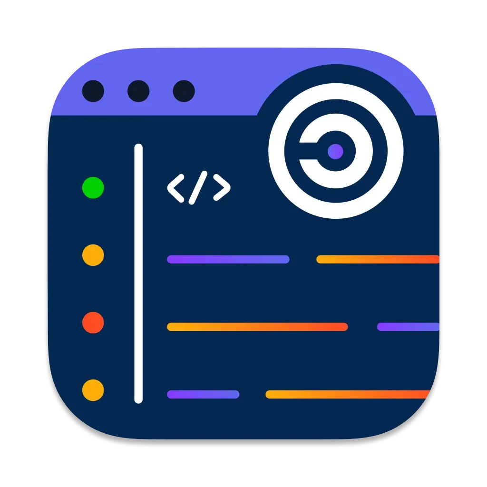

# SCANOSS Code Compare

SCANOSS Code Compare is a streamlined desktop application for managing open source findings with a clean, distraction-free interface. It features vim-style navigation (j/k), side-by-side code comparison for both snippet and 100% matches, and robust decision management that persists across scans. Users can quickly filter results, mark components as included/omitted/replaced with single keystrokes, and access their previous decisions in future scans.


## Features

- 🔍 Advanced code scanning and component identification
- 📊 Detailed dependency analysis and visualization
- 📝 License compliance checking and management
- 🔄 Real-time scanning results
- ⚡ Fast and efficient local processing
- 🎯 Accurate component matching
- 🖥️ Cross-platform support

## Prerequisites

- Go 1.x or higher
- Node.js and npm
- Wails CLI (`go install github.com/wailsapp/wails/v2/cmd/wails@latest`)

## Installation

### GUI Application

1. Download the latest release for your platform from the [releases page](https://github.com/scanoss/scanoss.cc/releases)
2. Follow the platform-specific installation instructions:
   - [macOS Installation Guide](INSTALL_MACOS.md)
   - Windows and Linux guides coming soon

### CLI Installation (macOS)

```bash
# Option 1: Create a symlink (Recommended)
sudo ln -s "/Applications/SCANOSS Code Compare.app/Contents/MacOS/SCANOSS Code Compare" /usr/local/bin/scanoss-cc

# Option 2: Add to PATH
echo 'export PATH="/Applications/SCANOSS Code Compare.app/Contents/MacOS:$PATH"' >> ~/.zshrc
echo 'alias scanoss-cc="\"/Applications/SCANOSS Code Compare.app/Contents/MacOS/SCANOSS Code Compare\""' >> ~/.zshrc
source ~/.zshrc
```

## Usage

### CLI Parameters

| Parameter      | Description                                                                 | Default Value |
|----------------|-----------------------------------------------------------------------------|---------------|
| **scan-root**  | Scanned folder                                                              | $WORKDIR |
| **input**      | Path to results.json file of the scanned project                            | $WORKDIR/.scanoss/results.json |
| **config**     | Path to configuration file                                                  | $HOME/.scanoss/scanoss-cc-settings.json |
| **apiUrl**     | SCANOSS API URL                                                             | https://api.osskb.org |
| **key**        | SCANOSS API Key token (not required for default OSSKB URL)                  | - |
| **debug**      | Enable debug mode                                                           | false |

### Example Commands

```bash
# Open the GUI application
scanoss-cc

# Open the GUI application with custom parameters (you can also change these from the GUI)
scanoss-cc --scan-root /path/to/scanned/project --input /path/to/results.json

# Basic scan with default settings
scanoss-cc scan /path/to/project

# Scan with custom results path
scanoss-cc scan --input /path/to/results.json

# Scan current directory with multiple parameters
scanoss-cc scan . --key $SCANOSS_API_KEY --apiurl $SCANOSS_API_URL --debug
```

## Development

### Setting Up the Development Environment

1. Clone the repository:
```bash
git clone https://github.com/scanoss/scanoss.cc.git
cd scanoss.cc
```

2. Run in development mode:
```bash
make run
```

### Development with Custom Parameters

```bash
# Using make command
make run APPARGS="--scan-root <scanRootPath> --input <resultPath>"

# Using wails command
wails dev -appargs "--input <resultPath>"
```

### Building

```bash
# Build for the current platform
make build
```

### Known Issues

#### Ubuntu 24.04 WebKit Issue

Ubuntu 24.04 includes webkit 4.1 while Wails expects webkit 4.0. To resolve:

For production:
```bash
sudo ln -sf /usr/lib/x86_64-linux-gnu/libwebkit2gtk-4.1.so.0 /usr/lib/x86_64-linux-gnu/libwebkit2gtk-4.0.so.37 &&
sudo ln -sf /usr/lib/x86_64-linux-gnu/libjavascriptcoregtk-4.1.so.0 /usr/lib/x86_64-linux-gnu/libjavascriptcoregtk-4.0.so.18
```

For development:
```bash
wails dev -tags webkit2_41
```

## Contributing

We welcome contributions! Please read our [Contributing Guidelines](CONTRIBUTING.md) and [Code of Conduct](CODE_OF_CONDUCT.md) before submitting pull requests.

### Reporting Bugs

When submitting bug reports, please include:
- SCANOSS Code Compare version
- Your system information (OS, Go version, etc.)
- Steps to reproduce the issue
- Expected vs actual behavior

## License

This project is licensed under the MIT License - see the [LICENSE](LICENSE) file for details.

## Support

For support, please:
1. Check our [documentation](https://scanoss.readthedocs.io)
2. Open an issue in this repository
